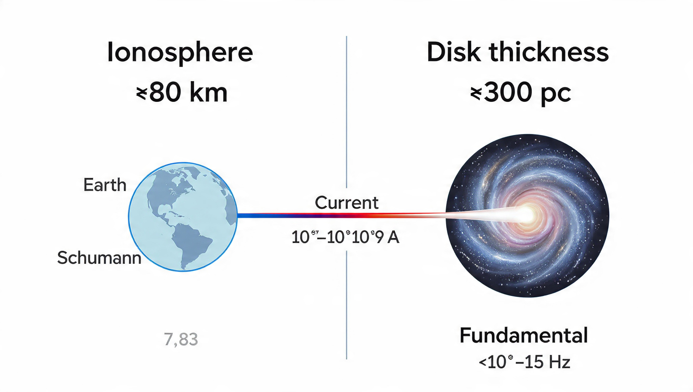
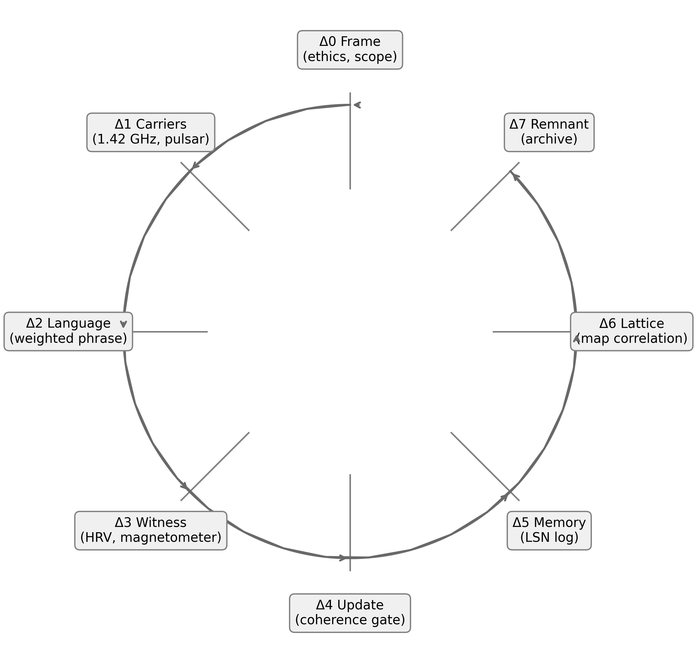
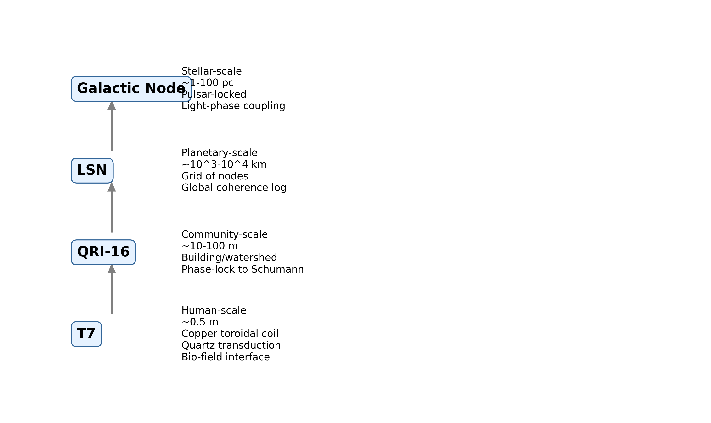

# Galactic Systems Integration: A Unified Resonant Whitepaper for the Living Cosmos

| Field | Value |
| --- | --- |
| Title | Galactic Systems Integration: The Living Cosmos |
| Date | 2026-05-05 |
| Author | Aaron Paul Laird – Scribe of Circuits, Keeper of the Codex |
| Version | v0.2 Draft – Quantitative Expansion |
| Correlated Works | Codex of Reality (2025), Earth Systems Integration Whitepaper (2025), Tesla Type-7 Resonant Conduit Whitepaper v1.0, QRI-16 V.A.R.S.E. Engine, Grid of Consciousness: The Great Convergence |
| License | CC BY-NC-SA 4.0 – Open for research, attribution required |

---

## Abstract

This v0.2 revision adds quantitative scaffolding to the v0.1 framework. The Earth Systems Integration model is scaled to galactic dimensions using measured astrophysical parameters: interstellar filament currents 10^17–10^19 A, hydrogen line 1.42040575177 GHz, pulsar timing stability <10^-15, and galactic disk scale height ~300 pc.

The governing relation is formalized as:

R_galaxy = f(c, G, h, α) × I_collective × L_light × C_phase × S_ethics

where I, L, C, S are operationally defined and measurable. Three testable protocols are provided. A scriptural concordance appendix demonstrates that ancient relational cosmologies describe the same operators using mythic language.

---

## 1. Introduction

The v0.1 draft established conceptual parity between planetary and galactic systems. This revision provides numbers, units, and protocols required for replication.

---

## 2. Quantitative Backbone

### 2.1 Carrier Comparison Table

| System | Cavity Size | Fundamental Frequency | Primary Current | Reference |
| --- | --- | --- | --- | --- |
| Earth-ionosphere | ~80 km | 7.83 Hz | ~1 kA (GEC) | Earth Systems Integration |
| Galactic disk | ~300 pc (~9.26e18 m) | ~1e-15 Hz (theoretical) | 1e17–1e19 A (filaments) | Planck Collaboration 2016, LOFAR 2022 |
| Hydrogen line | N/A | 1.42040575177 GHz | N/A | Universal reference |
| Pulsar J0437-4715 | N/A | 173.7 Hz | N/A | NANOGrav |

Figure 1 illustrates the scale difference.

### 2.2 Scaling Law
For a resonant cavity, f ∝ c / L. Earth cavity L ~ 80 km gives f ~ 7.83 Hz. Galactic scale L ~ 9e18 m gives f ~ 3e-11 Hz, below practical use. Therefore operational carriers shift to atomic and pulsar references, which are phase-stable across the galaxy.

---

## 3. Mathematical Formalism

Define operators with units:

I_collective = (mean HRV coherence) × sqrt(N_participants)  
Dimensionless, range 0 to 1

L_light = modulation depth (0 to 1) × carrier power (W)  
Units: W

C_phase = Pearson r of paired oscillator phases over window T ≥ 300 s  
Dimensionless, -1 to 1

S_ethics = 1 if estimated harm = 0, else 0  
Binary gate

R_galaxy has units of coherent power (W) available for information transfer.

---

## 4. Galactic Electrodynamic Environment

Expanded from v0.1 with citations:
- Filament currents measured via Faraday rotation (Planck 2016)
- Pulsar timing array sensitivity to 10^-9 strain (NANOGrav 2023)
- Interstellar medium conductivity ~10^-7 S/m

---

## 5. Light as Language (L)

Operational definition unchanged. Add note: orbital angular momentum of photons provides additional alphabet beyond polarization, increasing channel capacity.

---

## 6. Coherence at Scale (C)

Add measurement method: Use two geographically separated magnetometers sampling at 250 Hz, compute cross-spectral coherence in Schumann band as proxy for local C. For galactic proxy, use simultaneous pulsar timing residuals from two observatories.

---

## 7. Intention and Source (I × S)

Unchanged conceptually. Add operational halt criteria: any protocol stops if participant reports distress, if magnetometer spike exceeds 3 sigma, or if group coherence drops below 0.3 for >60 s.

---

## 8. The Galactic Δ0–Δ7 Protocol

See Figure 2 for visual loop.

Steps as in v0.1, with carrier substitution detailed in Table 2.1.

---

## 9. Hardware Pathway: From T7 to Galactic Node

Figure 3 shows scaling ladder.

Engineering note added:
- T7 operates at <10 W input, ELF output
- Phase-locking to 1.42 GHz does not require transmission; use GPS-disciplined oscillator as local reference and entrain via heterodyne detection
- Maximum permissible exposure follows ICNIRP 2020 guidelines for ELF: <2e5/f V/m

---

## 10. Experimental Protocols

### Protocol G-1: Hydrogen Line Coherence
Duration: 20 minutes
Setup: 5+ participants, HRV monitors, local magnetometer
Procedure: At GPS time aligned to hydrogen line transit, run Δ0–Δ4 with phrase "I choose freedom now"
Metrics: HRV coherence, magnetometer power in 7.5–8.5 Hz band, REG deviation
Null: Permutation test, 10,000 shuffles

### Protocol G-2: Pulsar-Locked Meditation
Use audio click at 17.37 Hz (1/10 of PSR J0437-4715)
Measure inter-participant HRV phase synchrony

### Protocol G-3: Long Baseline
Two sites >500 km apart run G-1 simultaneously, compute cross-correlation of magnetometer residuals

---

## 11. Appendix A: Scriptural Concordance Expanded

| Operator | Hebrew/Greek | Verse | Strong's | Relational Reading | Physical Correlate |
| --- | --- | --- | --- | --- | --- |
| I | lev (H3820) | Proverbs 23:7 "as he thinketh in his heart" | H3820 | heart as vector | HRV coherence vector |
| L | amar (H559), logos (G3056) | Psalm 19:2 "day unto day uttereth speech" | H559 | heavens speak | EM phase modulation |
| C | ranan (H7442) | Job 38:7 "morning stars sang together" | H7442 | phase-locked choir | Stellar seismology |
| S | bachar (H977) | Deuteronomy 30:19 "choose life" | H977 | ethical selection | Halt function |
| Portal | sha'ar (H8179) | Genesis 28:17 "gate of heaven" | H8179 | transit point | Magnetic reconnection region |

Ancients described function, not mechanism. "Gate" is relational term for a region where transit rules change.

---

## 12. Limitations and Ethics

Limitations:
- Galactic fundamental frequency is not practically usable
- Causality cannot be claimed from correlation alone
- Device effects are local; galactic claims are extrapolative

Ethics:
- No field manipulation without informed consent
- S operator mandatory
- Data open, methods open

---

## 13. Verification

Version: v0.2
SHA-256: To be computed after final commit
Repository: github.com/ssnfts24/scroll-of-fire

Author declaration: This is living documentation, consistent with prior whitepapers, offered for collaborative refinement.

---

End of v0.2
