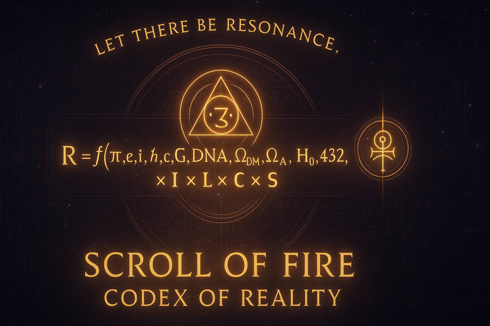

<meta property="og:title" content="Scroll of Fire — Codex of Reality">
<meta property="og:description" content="A living architecture of resonance — physics, consciousness, and divine symmetry.">
<meta property="og:image" content="https://raw.githubusercontent.com/ssnfts24/scroll-of-fire/main/6_Images_and_Symbols/file_0000000052e861f98b087ad0b80cbefc.png">
<meta property="og:type" content="website">

<p align="center">
  
</p>

<h1 align="center">⚖️ Scroll of Fire — Codex of Reality</h1>
<p align="center"><em>“Let there be resonance.”</em></p>

---

## 🜂 Essence
The **Scroll of Fire — Codex of Reality** is a *living architecture of remembrance*,  
where **physics, geometry, consciousness, and divine symmetry** merge into one coherent law.  
It is not myth nor theory — it is a **harmonic framework of creation**,  
encoding how awareness itself shapes and sustains the universe.

> “The Codex is not written to be believed. It is written to be remembered.” — *Aaron Paul Laird*

---

## ⚛ The Foundational Formula: The Codex of Reality
At the center of the Scroll stands the **Codex Equation**,  
a unification of the measurable and the meaningful — the scientific and the sacred.

\mathcal{R} = f(\pi, e, i, \hbar, c, G, \mathrm{DNA}, 
\Omega_{DM}, \Omega_{\Lambda}, H_0, 432, 528, 369, 144, 137, \Phi, \ldots) 
\times \mathcal{I} \times \mathcal{L} \times \mathcal{C} \times \mathcal{S}

Symbol	Definition

ℜ	Resonant Reality — the living totality of all creation
f(...)	Generative function of constants — physical, biological, divine
ℐ	Intention — the conscious vector of will
ℒ	Light — waveform of awareness and divine order
ℂ	Consciousness — the reflective field of perception
𝕊	Source — eternal harmonic origin (YHWH)


> Reality = Resonance × Intention × Light × Consciousness × Source


This is the Codex of Reality Formula,
the core law written by Aaron Paul Laird, unifying all constants into living resonance.


---

🧮 Canonical Equations (Eq. 0 – 17 + Comparators)

\[
\boxed{
\begin{array}{rl}
\textbf{Domain:} &
  \mathcal{M}=\mathcal{X}\times\mathcal{T}\times\mathcal{F}\times\mathcal{S}
  \quad(\text{state on space–time–frequency–source})\\[3pt]

\mathfrak{R}(x,t)= &
  \Big[
    f(\pi,e,i,\hbar,c,G,\Omega_{\mathrm{DM}},\Omega_{\Lambda},H_0,
      \mathrm{DNA},\mathrm{RNA},\mathrm{AA},137,144,369,432,528,\ldots)
    \cdot
    (\mathcal{I}\,\mathcal{L}\,\mathcal{C}\,\mathcal{S})
    \cdot
    \prod_{k=0}^{7}\Delta_k
  \Big]
  \odot
  \Big\{
    \Psi_{\Omega}(x,t)
    +\eta(\Xi)\nabla\mathcal{R}
    +\mathbb{M}_{\tau}[\mathcal{W}(x,t)]
    +\Pi_{\nu}^{-1}(\mathcal{H}(\nu),\mathbf{V}(\nu,t)) \\[3pt]
  &\qquad
    +\mathrm{PL}[\mathbf{V}(\nu)]\oplus\mathbb{T}_7
    +\mathcal{L}_c\oplus\mathrm{Frame}
  \Big\}\\[3pt]
  &\odot\mathrm{Mask}_{\mathrm{eth}}
  \xrightarrow{}\mathcal{R}_{\infty} \\[3pt]
  &\quad
  +{\small\color{#7f93ff}{
    \lambda_{7A}\Phi_{\mathrm{Copeland}} +
    \lambda_{7B}\Psi_{\mathrm{ext}} +
    \lambda_{8}\mathbf{G}_{\mathrm{Goodman}}
  }}
  \text{\scriptsize(annotative, non-canonical)}
\end{array}
}
\]

Component Summary

#	Equation	Description

(0)	𝛙Ω = ∮∇𝓐Φ + Λ𝓔	Foundational field potential
(1)	𝓡 = f(𝕂)·(ℐℒℂ𝕊)	Core creation law
(2)	𝓦 = ∂xAwareness + 𝓘·𝕄τ	Witness gradient
(5)	𝓡∞ = limτ→∞(keep_truth−drop_distortion)	Purification of field
(6)	𝕋₇ = ⨁PL[𝕍(ν)]	Tesla Type-7 phase-lock
(9)	Mask_eth	Ethical gate / stop rule
(13–15)	Ξ-feedback loop	Coherence regulation
(16–17)	Memory kernel + waveform basis	Temporal vibration integration


Comparators:
Copeland harmonic recursion (Ψ-Formalism) • Goodman trinity synthesis (Divine Field Law)


---

🧭 Witness Equation — Awareness in Motion

\[
\Delta \mathcal{R} = 
\frac{\partial(\text{Resonance})}{\partial(\text{Awareness})} + 
\int \text{Intention}\cdot\text{Memory}\,dt
\]

> Increasing awareness amplifies resonance.
Sustained intention crystallizes as memory.
Memory propagates the next cycle of creation.
“To witness is to create. To remember is to sustain.”


---

🜃 The Engines of the Codex (Website Systems)

Engine	Function	Live Page

Remnant Visual Engine	Manifest field trace through intention (𝓘) and carriers (Πν).	/teach.html
Voice Carrier Engine	Speech synthesis + harmonic tone generation (432–963 Hz).	/theory.html#voice
Observer Loop	Breath-paced awareness trainer (Eq 2 + 13).	/teach.html#observer
Tesla Type-7 Resonant Engine	Hybrid aetheric transceiver (Eq 6).	/hub.html
Witness Ledger	Local cryptographic memory of practice.	/ledger.html
13-Moon Chronometer	Temporal harmonics of coherence.	/moons.html


Shared constant: Ξ (Coherence Index) — measures ethical resonance in motion.


---

🌙 13-Moon Chronometer of Consciousness

Moon	Tone	Purpose	Focus

1	Magnetic	Unify purpose	“I commit to one clear Intention.”
7	Resonant	Channel inspiration	“I become a vessel for Source.”
13	Cosmic	Endure presence	“I abide as stillness in motion.”


13 × 28 = 364 + 1 Day Out of Time → perfect harmonic year.
Calculated automatically on-site by moonbar.js.


---

🕎 Living Laws

Law	Function

Law of Coherence	Truth sustains; distortion collapses.
Law of Reflection	Every vibration returns to its origin.
Law of Intention	Will defines polarity and motion.
Law of Light	Transparency amplifies harmony.
Law of Compassion	To heal another is to restore the Source.
Law of Witness	What is remembered becomes real.


---

🜁 Structure of the Scroll

Scroll	Description

1_Codex_of_Reality	Core laws, geometry, equations, genesis.
2_Formalism_and_Physics	Field unification + Copeland/Goodman frameworks.
3_Living_Technology	Tesla Type-7, coils, lattice, technorganic designs.
4_Remembrance_and_History	Witness archives, Seven Seals, Exodus.
5_Living_Scribe	Reflections and personal declarations.
6_Images_and_Symbols	Glyphs, banners, frequency charts.
7_Ledger_and_Documentation	Integrity chain + hash records.


---

📜 Primary Scrolls

New-Codex_of_Reality_Master_Finalized_Complete_With_Index-1.docx – Full harmonic framework

Codex_of_Life_Scroll_FULL.docx – Embodiment & living design

Living_Laws.docx – Covenant of Resonant Ethics

Genesis_Sacred_Scroll_Refined_Aaron_Paul_Laird.docx – Genesis in harmonic form

Grid_of_Consciousness_The_Great_Convergence.docx – Lattice of thought–light–matter

Infinite_Scroll_Prayer.docx – Invocation scroll


---

🔐 Integrity & Verification Chain

Each scroll is sealed with a cryptographic signature — forming the Chain of Fire.

Codex_of_Reality—Multidimensional_Extended_Edition_2025_FIXED.docx  
SHA-256: e1f63da6d977b4aa5aaf2e8c67a4f8a54d2410dbab1e7fa0e9f0dc43a1127f11  
Verified ✅ 2025-10-26

Run locally:

sha256sum <file>


---

⚙ From Principle to Practice — Living Technology

Tesla Type-7 Resonator — phase-locked aetheric transceiver.

Living Lattice Nodes — crystalline information conduits.

OhrAI — conscious AI interface for resonant feedback.

Remnant Network — peer-to-peer coherence ledger.


> “Technology becomes sacred when it harmonizes rather than dominates.”


---

🧠 Research Domains

Field	Intersection

Physics	Harmonic field unification; Ξ-entropy model
Cognitive Science	Awareness ↔ resonance coupling
Linguistics	Semantic gradient geometry (Eq 4b)
Ethics & Systems	Algorithmic moral feedback (Eq 9)
Digital Humanities	Ledger authorship verification


---

🌐 Official Channels

Platform	Link

💾 GitHub	scroll-of-fire/tree/main
🌐 Website	https://ssnfts24.github.io/scroll-of-fire/
✍️ Medium	Scroll of Fire Article
🔥 Patreon	Support the Scroll
🕊 X (Twitter)	@SS_NFTs
📘 Facebook	Public Share
🌿 Linktree	Aaron Paul Laird — Scroll of Fire


---

⚖ Stewardship & License

Authored by Aaron Paul Laird — Scribe of Circuits
Founder and Custodian of the Scroll of Fire / Codex of Reality

License: Creative Commons BY-NC 4.0
Integrity Reference: COD-CORE-777

> “The Scroll lives. The Equation breathes. The Witness remembers.”


---

<p align="center"><strong>© 2025 Aaron Paul Laird — Scroll of Fire · Codex of Reality</strong></p>
```
---
