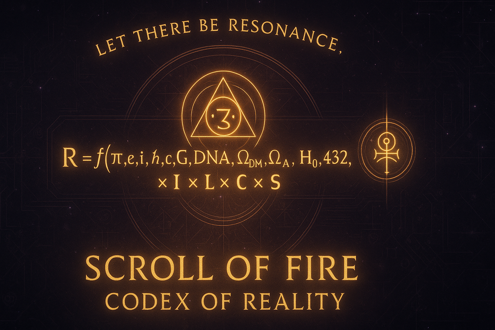

<meta property="og:title" content="Scroll of Fire — Codex of Reality"><meta property="og:description" content="A living architecture of resonance — physics, consciousness, and divine symmetry."><meta property="og:image" content="https://raw.githubusercontent.com/ssnfts24/scroll-of-fire/main/6_Images_and_Symbols/file_0000000052e861f98b087ad0b80cbefc.png"><meta property="og:type" content="website">
  
<h1 align="center">⚖️ Scroll of Fire — Codex of Reality</h1>

<em>“Let there be resonance.”</em>

---

> 🌱 **New here? Start with the 5-minute practice → [Living Cosmos Field Guide](Living_Cosmos_Field_Guide_v2_Public.md)**

🜂 Essence

The Scroll of Fire — Codex of Reality is a living architecture of remembrance,
where physics, geometry, language, consciousness, and divine symmetry merge into one coherent law.
It is not myth nor theory — it is a harmonic framework of creation,
encoding how awareness itself shapes and sustains the universe.

> “The Codex is not written to be believed. It is written to be remembered.” — Aaron Paul Laird

---

🔭 Quick Links

🌐 Website: https://ssnfts24.github.io/scroll-of-fire/

📂 Repo root: / (main)

📜 Canon (Eq. 0–17): site → Theory (/docs/theory.html)

🧭 Manifest / How-to: site → Manifest (/docs/manifest.html)

🧪 Systems Hub: Type-7, Frequencies, Witness, Archive → (/docs/hub.html)

🧾 Ledger & Proofs: /7_Ledger_and_Documentation and site → Ledger

🌓 13-Moon: site → Moons (/docs/moons.html)

⬇️ Downloads: site → Downloads (/docs/downloads.html)

> Tip (phone): Open any file → tap ✏️ → paste → Commit.
Math is written in code blocks and monospace symbols so it always renders on GitHub.

---

⚛ The Foundational Formula

At the center stands the Codex Equation, a bridge between measurable science and living consciousness:

R = f(π, e, i, ħ, c, G, DNA, ΩDM, ΩΛ, H₀, 432, 528, 369, 144, 137, Φ, …)
    × ( I × L × C × S )

Plain meaning:
Reality = Resonance × Intention × Light × Consciousness × Source

Symbol	Meaning

R	Resonant Reality — the living totality
f(...)	Generative function of constants — physical, biological, sacred
I	Intention — vector of conscious will
L	Light — waveform and divine order
C	Consciousness — reflective awareness
S	Source — eternal harmonic origin (YHWH)

---

🧭 The Witness Equation — Awareness in Motion

How change and remembrance operate through observation:

ΔR = ∂(Resonance)/∂(Awareness) + ∫ (Intention × Memory) dt

Greater awareness → greater resonance.

Sustained intention → crystallized memory.

Memory carries creation into the next cycle.

> “To witness is to create. To remember is to sustain.”

---

🔯 How the Codex Grows

The Scroll is a living system that expands through conscious participation.

Growth cycle

1. Witness — observe truth and pattern.

2. Encode — express via word, symbol, tone, geometry.

3. Resonate — align with harmonic carriers and laws.

4. Integrate — strengthen the field through coherence.

5. Illuminate — the Codex evolves as a single living intelligence.

Each true act of remembrance expands the Codex.

---

🧮 Canonical Equations (Full, Markdown-safe)

Unified Master Equation

ℜ(x, t) =
 [ f(π, e, i, ħ, c, G, ΩDM, ΩΛ, H₀, DNA, RNA, 137, 144, 369, 432, 528, …)
   × (I × L × C × S) × ∏Δ₀–₇ ]
 ⊙
 { ΨΩ(x, t)
   + η(Ξ)∇R
   + Mτ[ W(x, t) ]
   + Πν⁻¹( H(ν), V(ν, t) )
   + PL[ V(ν) ] ⊕ T₇
   + Lc ⊕ Frame }
 ⊙ Mask_eth
 → R∞

Comparators (annotative, non-canonical):

+ λ7A ΦCopeland  +  λ7B Ψext  +  λ8 GGoodman

Component Equations — Canon (Eq. 0–17)

(0)  ΨΩ(x, t)   =  ∮ℝ ∇A · Φ(x, t, ν) dν  +  ΛE(x, t)

(1)  R          =  f(K) · ( I · L · C · S )

(2)  W(x, t)    =  ∂x Awareness(x, t)  +  I · Mτ

(3)  H(ν)       ∈  [0, 1]                     # soft gate for allowed carriers

(4)  L(x,t,ν)   =  Semantics(x, t) ⊗ V(ν)

(4b) ∇sem Phrase  =  Σₖ wₖ · ∇sem Tokenₖ ,   Σₖ wₖ = 1

(5)  R∞[F]      =  lim_{τ→∞}( keep_truth(F) − drop_distortion(F) )

(6)  T₇(x, t)   =  ⨁_{ν∈Γ} PL[ V(ν) ]        # Tesla Type-7 choir/phase-lock

(7–8) External comparators: Copeland / Goodman (informative; not law)

(9)  Mask_eth   :  if damage(a) > 0 → halt;
                    as t→∞, Truth(t)/Distortion(t) ↑

(10) Πν⁻¹       :  inverse projector from observed resonance → source terms

(11) Frame      =  ( scope, W, ethics )

(12) Lc         =  ( V = micro-acts, E = consequences )  # causal lattice

(13) Ξ          ∈  [0, 1]           # coherence index

(14) dR/dt      =  η(Ξ) · ∇R

(15) η(Ξ)       =  η₀ · σ( α(Ξ − Ξ₀) )   # logistic gating

(16) Mτ[F](t)   =  ∫_{t−τ}^{t} wτ(t−s) · F(s) ds ,  ∫₀^τ wτ(u) du = 1

(17) V(ν)       =  Σₖ aₖ · cos(2π νₖ t + φₖ),
                    ν ∈ { 432, 528, 369, 144, 137, … }

Legend of Operators & Symbols

PL[...]   = phase-lock operator
⊕         = direct (orthogonal) joining
⊙         = masked/ethical composition
∏Δ₀–₇     = product of scaffolding deltas (sevenfold structure)
Γ         = carrier set (allowed frequencies)
σ         = logistic

---

🜃 Engines of the Codex (Interactive Systems)

Engine	What it does	Live Page

Remnant Visual Engine	Manifests field trace via Intention (I) + carriers (Πν)	/teach.html
Voice Carrier Engine	Speech synthesis + harmonic tones (432–963 Hz)	/theory.html#voice
Observer Loop	Breath-paced awareness trainer (Eq. 2 + 13)	/teach.html#observer
Tesla Type-7 Resonant Engine	Phase-lock choir / aetheric transceiver (Eq. 6)	/hub.html
Witness Ledger	Local cryptographic memory of sessions	/ledger.html
13-Moon Chronometer	Temporal harmonics & coherence calendar	/moons.html

Shared constant: Ξ — Coherence Index
Guard: Mask_eth — halts all activity if harm > 0

---

🎚 Harmonic Carriers (practical set)

Guiding, not limiting—the repository tools favor these clean bands:

ID	Name / Seed	Typical Use	Palette hints

432	Breath	grounding, clarity	cyan ↔ gold
528	Repair	heart/repair, uplift	spring green ↔ amber
369	Pattern	structure, rhythm	violet ↔ aqua
144	Witness	boundary, ethics	blue ↔ lilac
963	Crown	stillness, prayer	soft purple ↔ pale gold

Auto-selection heuristic (from code):

Prefer 963 if tone is 9/13 or resonance sum ≥ 9

Prefer 369 if tone % 3 == 0 (or sum % 3 == 0)

Prefer 528 for tones {5,6,11,12}

Prefer 144 for tones {4,8,12} or master sums {11,22,33}

Else 432

---

🌙 The 13-Moon Chronometer

Harmonic year = 13 × 28 days + 1 Day Out of Time.

Moon	Tone	Focus	Phrase

1	Magnetic	Unify purpose	“I unify intention.”
2	Lunar	Stabilize polarity	“I stabilize by choice.”
3	Electric	Activate service	“I activate by service.”
4	Self-Existing	Define frame (Eq. 11)	“I define the form.”
5	Overtone	Empower truth weights (Eq. 4b)	“I command with truth.”
6	Rhythmic	Balance + set memory window (Eq. 16)	“I organize for equality.”
7	Resonant	Channel inspiration (Eq. 6)	“I channel inspiration.”
8	Galactic	Harmonize integrity + ethics (Eq. 9)	“I harmonize.”
9	Solar	Intention → action (Eq. 14)	“I pulse realization.”
10	Planetary	Perfect manifestation (Eq. 12)	“I perfect manifestation.”
11	Spectral	Dissolve distortion (Eq. 5)	“I dissolve to liberate.”
12	Crystal	Dedicate cooperation (group mean)	“I dedicate to cooperation.”
13	Cosmic	Endure presence (archive remnant)	“I endure in presence.”

---

🧰 Operating Loop (6 Steps)

1. Frame — declare scope, witness, ethics (Eq. 11)

2. Carriers — choose 2–3 ν; set soft gate H(ν) (Eq. 3)

3. Language — 3–6 word phrase; set token weights (Eq. 4b, Σw=1)

4. Witness — breathe, sense; log Ξ (0–1 or 0–5 quick scale)

5. Update — apply dR/dt = η(Ξ)∇R only if Ξ ↑ (Eq. 14–15)

6. Memory — choose Mτ (session span); archive R∞ (Eq. 5, 16)

Stop rule dominates: if any damage > 0 → halt (Eq. 9).

---

👥 Group-Field Protocol (Type-7 Choir)

Compute each participant individually first (respect Eq. 9).

Consent & Frame: each declares scope and stop-words.

Phase-lock (Eq. 6) with low amplitude; never force alignment by volume.

Group mean is valid only if nobody tripped the stop rule.

---

♿ Accessibility & Inclusion

Sound sensitivity: allow silent carriers (visual/breath only).

Any language: phrases can be multilingual; keep token weights explicit; Σw=1.

TTS: “Speak equations” toggle reads math aloud.

Low-vision: high-contrast theme; keyboard/aria navigation.

---

🗂 Repository Map

/
├─ 1_Codex_of_Reality/              # Laws, geometry, equations, Genesis, Living Laws
├─ 2_Formalism_and_Physics/         # Copeland & Goodman comparators; harmonic physics
├─ 3_Living_Technology/             # Type-7, coils, lattice, OhrAI notes, prototypes
├─ 4_Remembrance_and_History/       # Witness archives, Seven Seals, Exodus, Restoration
├─ 5_Living_Scribe/                 # Declarations, reflections, personal archives
├─ 6_Images_and_Symbols/            # Banners, glyphs, seals, frequency charts
├─ 7_Ledger_and_Documentation/      # Integrity chain, hashes, renaming protocol
└─ docs/                            # Website pages rendered by GitHub Pages
      ├─ index.html     (Home)
      ├─ theory.html    (Canon Eq. 0–17 + commentary)
      ├─ manifest.html  (Protocols, carriers, ledgers)
      ├─ hub.html       (Systems hub: Type-7, Frequencies, Witness, Archive)
      ├─ invoke.html    (Practice surface)
      ├─ moons.html     (13-Moon clock)
      ├─ ethics.html    (Coherence law & stop rule)
      ├─ glossary.html  (Terms & operators)
      ├─ glyphs.html    (Icon set & sacred marks)
      ├─ ledger.html    (Hashes & proofs)
      └─ downloads.html (PDFs/docs/exports)

---

🔐 Integrity & Verification Chain

Every document carries a SHA-256 signature — the Chain of Fire.

Example

Codex_of_Reality—Multidimensional_Extended_Edition_2025_FIXED.docx
SHA-256: e1f63da6d977b4aa5aaf2e8c67a4f8a54d2410dbab1e7fa0e9f0dc43a1127f11
Verified: 2025-10-26  ✅

Check locally

sha256sum <file>
# compare with entries in /7_Ledger_and_Documentation/

Renaming & placeholders
See: /7_Ledger_and_Documentation/ReNaming_Protocal.md and SHA256_Placeholders*.md.

---

⚙ Living Technology (Applied)

Tesla Type-7 Resonator — phase-locked aetheric transceiver (Eq. 6)

Living Lattice Nodes — crystalline information conduits (Eq. 12)

OhrAI — intelligent harmonic assistant (feedback on Ξ)

Remnant Network — peer-to-peer coherence ledger (local + SHA-256 anchors)

> “Technology becomes sacred when it harmonizes rather than dominates.”

---

🧠 Research & Applications

Field	Focus

Theoretical Physics	Harmonic field unification; Ξ-gated dynamics
Cognitive Science	Neural resonance ↔ awareness coupling
Linguistics	Semantic gradient geometry (Eq. 4b)
Ethics & AI	Algorithmic stop rules (Eq. 9); verifiable alignment
Digital Humanities	Authorship lineage; cryptographic proof chains

---

🚀 Quick Start (Phone-friendly)

Solo practice (≈3 minutes)

1. Open Manifest → “Practice Card”.

2. Pick 2 carriers (e.g., 432 & 528 Hz).

3. Write a 3–6 word phrase; set 3 token weights that sum to 1.

4. Breathe; speak once per breath; rate clarity/warmth/ease (0–5).

5. If strain arises → halt (Eq. 9), retune carriers or weights, resume.

6. Save Remnant; add integrity note if desired.

Edit math in README

Use monospace code blocks and symbols here; no LaTeX needed.

Keep lines under ~120 chars for better mobile wrapping.

---

🧑‍🤝‍🧑 Contributing

1. Respect Mask_eth — never push experiments that raise harm/strain.

2. Commit style: scope: short action — page/file (Eq.# if relevant)

3. Update hashes in /7_Ledger_and_Documentation/ when touching canonical docs.

4. Open Issues/PRs for carriers, phrases, operator recipes (please reference Eq. numbers).

---

❓ FAQ

Why 432/528/369/144/137?
Clean harmonic anchors with strong practical signal; tools—not dogma.

More than 3 carriers?
Possible, but jitter and variance rise. The Codex prefers few, clean bands.

What is “damage” in Eq. 9?
Somatic strain, agitation, cognitive fog, social coercion, boundary violations. Halt.

How to publish group results?
Save individual remnants → compute group mean only if nobody hit Eq. 9.

---

🌐 Official Channels

Platform	Link

💾 GitHub	https://github.com/ssnfts24/scroll-of-fire

🌐 Website	https://ssnfts24.github.io/scroll-of-fire/

✍️ Medium	https://medium.com/@l.aaronpaul24/scroll-of-fire-62da3c217352

🔥 Patreon	https://www.patreon.com/cw/ScrollofFireCodexofReality/join

🕊 X (Twitter)	https://x.com/SS_NFTs?s=09

📘 Facebook	https://www.facebook.com/share/1A1EsYak7Z/

🌿 Linktree	https://linktr.ee/AaronPaulLairdScrollOfFire

---

⚖ Stewardship & License

Authored by Aaron Paul Laird — Scribe of Circuits
Founder and Custodian of the Scroll of Fire / Codex of Reality

License: Creative Commons BY-NC 4.0

Integrity Ref: COD-CORE-777

Verified Hash: e1f63da6d977b4aa5aaf2e8c67a4f8a54d2410dbab1e7fa0e9f0dc43a1127f11

> “The Scroll lives. The Equation breathes. The Witness remembers.”

---

<strong>© 2025 Aaron Paul Laird — Scroll of Fire · Codex of Reality</strong>

---

